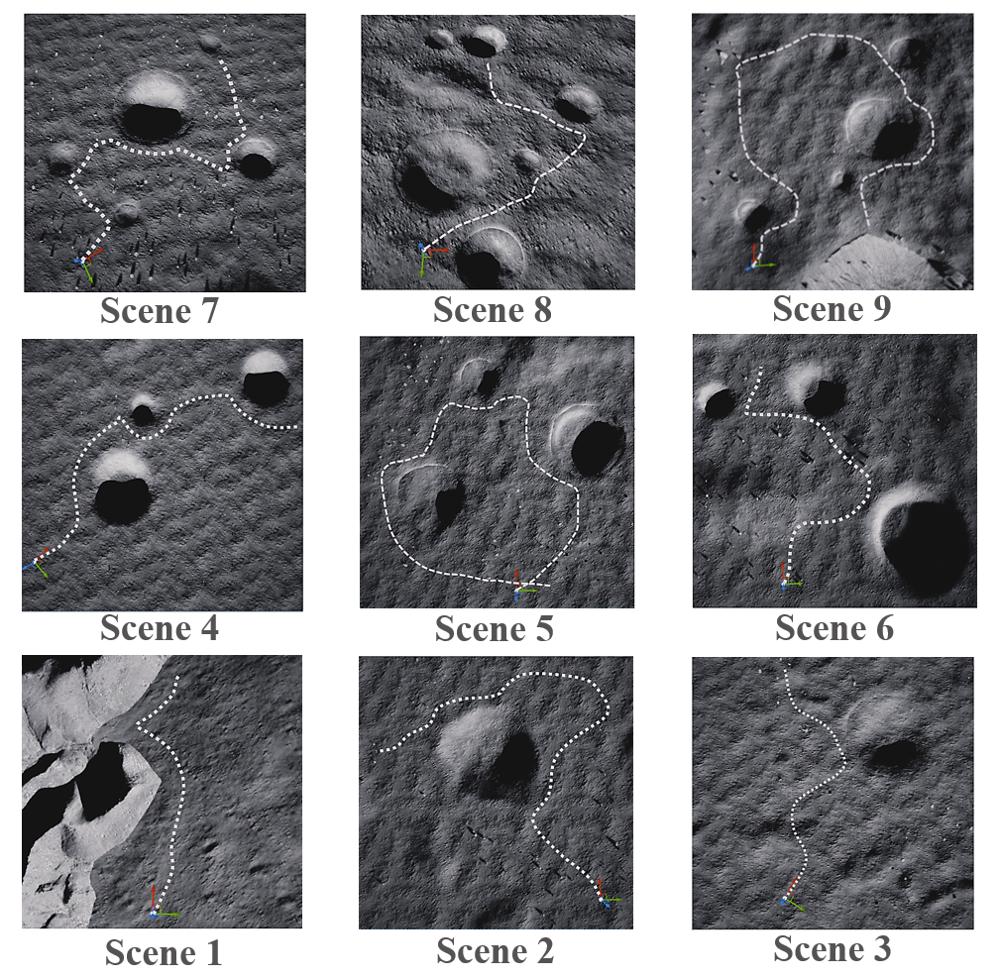
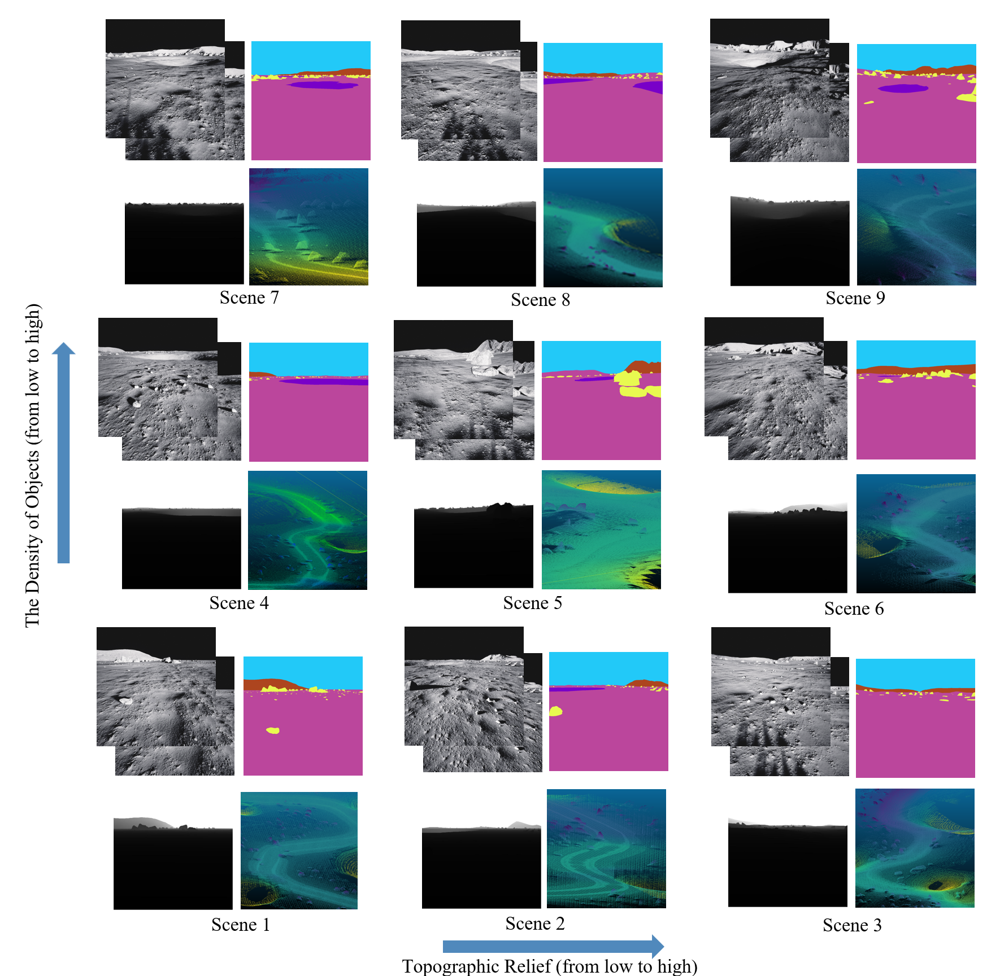
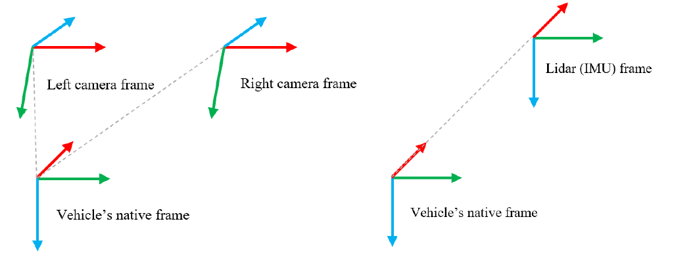

# LuSNAR Dataset

## Introduction

This repository contains a lunar segmentation, navigation and reconstruction dataset **LuSNAR** based on multi-sensor (**Stereo Camera**, **LiDAR**, **IMU**) for autonomous exploration.
The **LuSNAR** is a multi-task, multi-scene, and multi-label lunar dataset, it includes **9** lunar simulation scenes based on Unreal Engine and each scene is divided according to topographic relief and the density of objects.

## Scene Diagram


## Trajectory Diagram


## Data Diagram
The LuSNAR dataset includes:
- High-resolution stereo image pairs
- Panoramic semantic labels
- Dense depth maps
- LiDAR point clouds
- IMU data
- Rover pose data


### Use Cases
The dataset can be used for comprehensive evaluation of autonomous perception and navigation systems:
- 2D/3D Semantic Segmentation
- Visual/LiDAR SLAM
- 3D Reconstruction

### Availability
The LuSNAR dataset is available for download from CSTCloud.
[LuSNAR Dataset Download](https://pan.cstcloud.cn/s/2Ie7D5PSLU)
Password:fjZt

## Dataset Structure
The LuSNAR dataset has a total size of **108GB**, containing:
- **42GB** of stereo image pairs
- **50GB** of depth maps
- **356MB** of semantic segmentation labels
- **14GB** of single-frame point cloud data with semantic information
```plaintext
├── image1
│   ├── RGB
│   │   ├── timestamp1.png
│   │   ├── timestamp2.png
│   │   └── ...
│   ├── Depth
│   │   ├── timestamp1.png
│   │   ├── timestamp2.png
│   │   └── ...
│   └── Label
│       ├── timestamp1.png
│       ├── timestamp2.png
│       └── ...
├── image2
│   ├── RGB
│   │   ├── timestamp1.png
│   │   ├── timestamp2.png
│   │   └── ...
│   ├── Depth
│   │   ├── timestamp1.png
│   │   ├── timestamp2.png
│   │   └── ...
│   └── Label
│       ├── timestamp1.png
│       ├── timestamp2.png
│       └── ...
├── LiDAR
│       ├── timestamp1.txt
│       ├── timestamp2.txt
│       └── ...
├── Rover_pose.txt
└── IMU.txt
```
The correspondence between the colors in semantic images and category numbers is as follows:

| Category Number | Category       | Color   |
|-----------------|----------------|---------|
| 0               | Lunar regolith |  |
| 1               | Impact crater  |  |
| 2               | Rock           |  |
| 3               | Mountain       |  |
| 4               | Sky            |  |


The correspondence between category numbers and their respective categories in the LiDAR point cloud data is as follows:

| Category Number | Category       |
|-----------------|----------------|
| -1              | Lunar regolith |
| 0               | Impact crater  |
| 174             | Rock           |

Diagram showing the orientation of the rover and different sensor coordinate systems(For details on the extrinsic parameters, please refer to the paper.):

The extrinsic parameters of different sensors relative to the lunar rover body coordinate system are as follows:
- **Parent:** Body
    - **Child:** IMU
        - **Translation:** [1.000, 0.000, -1.500] // x, y, z
        - **Rotation:**
            - **Quaternion:** [0.000, 0.000, 0.000, 1.000] // qx, qy, qz, qw
            - **RPY (radian):** [0.000, -0.000, 0.000] // roll, pitch, yaw (rad)
            - **RPY (degree):** [0.000, -0.000, 0.000] // roll, pitch, yaw (degree)

    - **Child:** LiDAR
        - **Translation:** [1.000, 0.000, -1.500]
        - **Rotation:**
            - **Quaternion:** [0.000, 0.000, 0.000, 1.000]
            - **RPY (radian):** [0.000, -0.000, 0.000]
            - **RPY (degree):** [0.000, -0.000, 0.000]

    - **Child:** Left Camera
        - **Translation:** [1.000, -0.155, -1.500]
        - **Rotation:**
            - **Quaternion:** [0.406, 0.406, 0.579, 0.579]
            - **RPY (radian):** [1.223, -0.000, 1.571]
            - **RPY (degree):** [70.077, -0.000, 90.000]

    - **Child:** Right Camera
        - **Translation:** [1.000, 0.155, -1.500]
        - **Rotation:**
            - **Quaternion:** [0.406, 0.406, 0.579, 0.579]
            - **RPY (radian):** [1.223, -0.000, 1.571]
            - **RPY (degree):** [70.077, -0.000, 90.000]

## File Format
### LiDAR/timestamp.txt
```plaintext
| x [m] | y [m] | z [m] | category number |
```
### Rover_pose.txt
```plaintext
| timestamp [ns] | p_RS_R_x [m] | p_RS_R_y [m] | p_RS_R_z [m] | q_RS_w [] | q_RS_x [] | q_RS_y [] | q_RS_z [] | v_RS_R_x [m s^-1] | v_RS_R_y [m s^-1] | v_RS_R_z [m s^-1] | b_w_RS_S_x [rad s^-1] | b_w_RS_S_y [rad s^-1] | b_w_RS_S_z [rad s^-1] | b_a_RS_S_x [m s^-2] | b_a_RS_S_y [m s^-2] | b_a_RS_S_z [m s^-2] |
```
### IMU.txt
```plaintext
| timestamp [ns] | w_RS_S_x [rad s^-1] | w_RS_S_y [rad s^-1] | w_RS_S_z [rad s^-1] | a_RS_S_x [m s^-2] | a_RS_S_y [m s^-2] | a_RS_S_z [m s^-2] |
```


