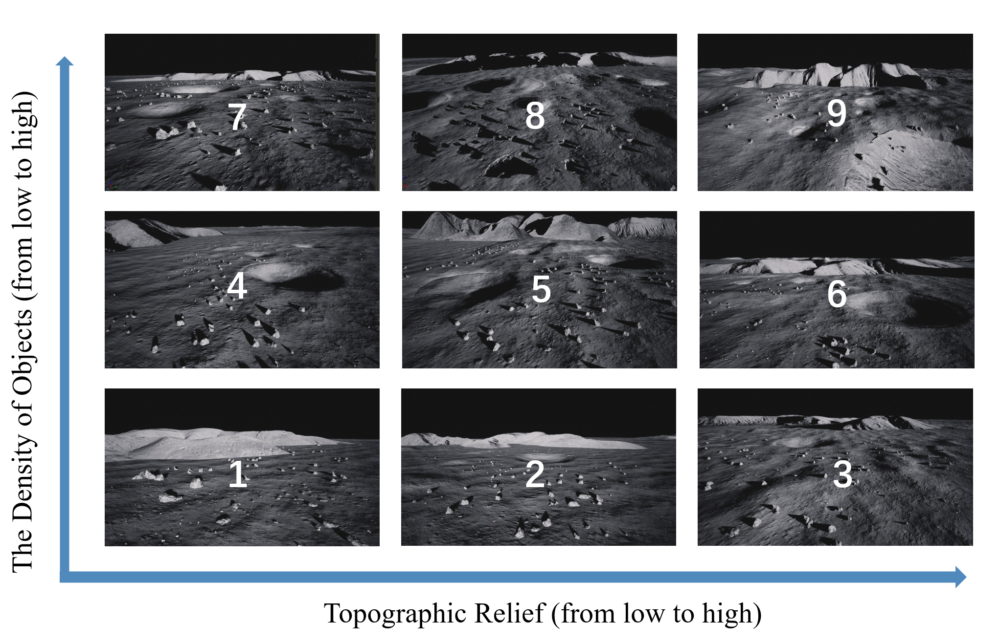
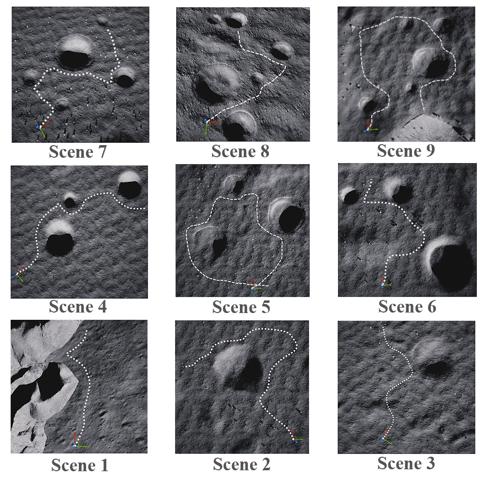
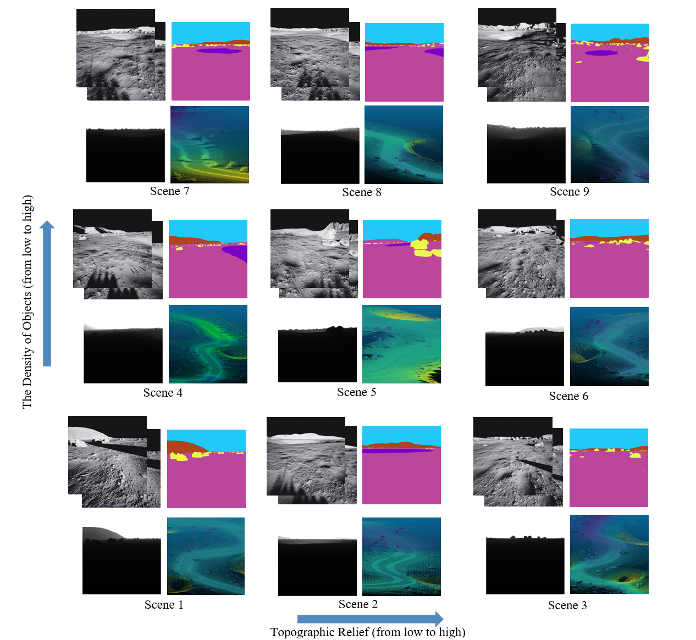

# LuSNAR: A Lunar Segmentation, Navigation and Reconstruction Dataset

<div align="center">

[](https://arxiv.org/abs/2407.06512)
[](https://github.com/zqyu9/LuSNAR-dataset)
[](https://pan.cstcloud.cn/s/2Ie7D5PSLU)
[](https://huggingface.co/datasets/JeremyLuo/LuSNAR)
[](LICENSE)

**Jiayi Liu¹** · **[Xubo Luo](https://luoxubo.github.io/)¹** · **Qianyu Zhang¹** · **[Xue Wan](https://people.ucas.edu.cn/~wanxue)²** · **Chenming Ye³** · **Shengyang Zhang¹** · **Yaolin Tian¹** · **Haodong Han¹** · **Yutao Zhao¹** · **Baichuan Liu¹** · **Zeyuan Zhao¹** · **[Zhizhong Kang](https://scholar.cugb.edu.cn/scholar/scholarDetail/347.shtml)³**

1 *University of Chinese Academy of Sciences*<br>
2 *Chinese Academy of Sciences*<br>
3 *China University of Geosciences (Beijing)*

**Under Review at IEEE Transactions on Geoscience and Remote Sensing (TGRS)**

</div>

---

## 📰 News

- **[2024.09]** 🎉 Paper submitted to TGRS and currently under review
- **[2024.09]** 📝 arXiv v3 released with updated experimental results
- **[2024.07]** 🚀 LuSNAR dataset and code publicly released
- **[2024.07]** 📄 Initial preprint available on arXiv

---

## 🌟 Highlights

- **🌕 First Multi-Task Lunar Benchmark**: Comprehensive dataset supporting semantic segmentation, SLAM, and 3D reconstruction simultaneously
- **📊 108GB High-Quality Data**: Multi-sensor synchronized data including stereo cameras, LiDAR, and IMU across 9 diverse lunar scenes
- **🎯 Pixel-Perfect Ground Truth**: High-precision semantic labels, depth maps, and 3D point clouds with category annotations
- **🏔️ Diverse Terrain Coverage**: Scenes categorized by topographic relief and object density for robust algorithm evaluation
- **🔧 Unreal Engine Based**: Photo-realistic rendering with physically accurate sensor simulation

---

## 🎬 Overview

<div align="center">
  
  <p><i>Nine simulation scenes with varying topographic complexity and object density</i></p>
</div>

**LuSNAR** addresses the critical gap in autonomous lunar exploration by providing a multi-task, multi-scene, and multi-label benchmark dataset. Unlike existing datasets that focus on single tasks, LuSNAR enables comprehensive evaluation of perception and navigation systems essential for next-generation lunar rovers.

### Key Features

- ✅ **High-Resolution Stereo Pairs**: 1024×1024 resolution at 10 Hz with 310 mm baseline
- ✅ **Dense Depth Maps**: Pixel-accurate depth information for stereo matching and 3D reconstruction
- ✅ **Panoramic Semantic Labels**: Five-class semantic segmentation (regolith, craters, rocks, mountains, sky)
- ✅ **LiDAR Point Clouds**: 128-beam spinning LiDAR with semantic annotations
- ✅ **IMU & Pose Data**: 100 Hz IMU measurements with ground truth trajectories
- ✅ **Multi-Scene Diversity**: Nine scenes representing varied lunar terrain characteristics

---

## 🎯 Supported Tasks

<table align="center">
  <tr>
    <td align="center">
      <b>🖼️ 2D Semantic Segmentation</b><br>
      <sub>Pixel-wise scene understanding</sub>
    </td>
    <td align="center">
      <b>🧊 3D Semantic Segmentation</b><br>
      <sub>Point cloud classification</sub>
    </td>
  </tr>
  <tr>
    <td align="center">
      <b>🗺️ Visual SLAM</b><br>
      <sub>Camera-based localization</sub>
    </td>
    <td align="center">
      <b>📡 LiDAR SLAM</b><br>
      <sub>3D mapping and odometry</sub>
    </td>
  </tr>
  <tr>
    <td align="center">
      <b>🔍 Stereo Matching</b><br>
      <sub>Depth estimation from stereo</sub>
    </td>
    <td align="center">
      <b>🏗️ 3D Reconstruction</b><br>
      <sub>Dense surface reconstruction</sub>
    </td>
  </tr>
</table>

---

## 📊 Dataset Statistics

<div align="center">

| **Component** | **Size** | **Details** |
|:-------------:|:--------:|:------------|
| Stereo Images | 42 GB | 1024×1024, 80°×80° FOV, 10 Hz |
| Depth Maps | 50 GB | Dense per-pixel depth |
| Semantic Labels | 356 MB | 2D masks + 3D point annotations |
| LiDAR Point Clouds | 14 GB | Up to 20M points/sec, semantic labels |
| IMU Data | - | 100 Hz, 6-DOF measurements |
| Ground Truth Poses | - | Sub-millimeter accuracy |
| **Total Size** | **108 GB** | **9 scenes, multiple trajectories** |

</div>

<div align="center">
  
  <p><i>Sample trajectory visualization across different scenes</i></p>
</div>

---

## 📁 Dataset Structure

```
LuSNAR/
├── image1/                    # Left camera
│   ├── RGB/                   # Color images
│   │   ├── timestamp1.png
│   │   └── ...
│   ├── Depth/                 # Depth maps
│   │   ├── timestamp1.png
│   │   └── ...
│   └── Label/                 # Semantic labels
│       ├── timestamp1.png
│       └── ...
├── image2/                    # Right camera (same structure)
├── LiDAR/                     # Point cloud data
│   ├── timestamp1.txt         # Format: x y z category
│   └── ...
├── Rover_pose.txt             # Ground truth trajectory
└── IMU.txt                    # IMU measurements
```

---

## 🎨 Semantic Categories

<div align="center">


<p><i>Multi-modal data visualization: RGB, semantic labels, depth, and LiDAR</i></p>

### 2D Semantic Labels

| Category | Color | Hex Code |
|:--------:|:-----:|:--------:|
| Lunar Regolith |  | `#BB469C` |
| Impact Crater |  | `#7800C8` |
| Rock |  | `#E8FA50` |
| Mountain |  | `#AD451F` |
| Sky |  | `#22C9F8` |

### 3D Point Cloud Labels

| Category ID | Category |
|:-----------:|:--------:|
| -1 | Lunar Regolith |
| 0 | Impact Crater |
| 174 | Rock |

</div>

---

## ⚙️ Sensor Specifications

### 📷 Stereo Camera

- **Resolution**: 1024 × 1024 pixels
- **Frame Rate**: 10 Hz
- **Field of View**: 80° × 80°
- **Baseline**: 310 mm
- **Focal Length**: 610.17784 pixels

### 📡 LiDAR

- **Type**: 128-beam spinning LiDAR
- **Frequency**: 10 Hz
- **Horizontal FOV**: 360°
- **Vertical FOV**: -25° to +27°
- **Range**: ≤30 m
- **Point Rate**: Up to 20M points/second

### 🧭 IMU

- **Frequency**: 100 Hz
- **Axes**: 3-axis accelerometer & gyroscope
- **Accelerometer Random Walk**: 0.002353596 m/s³√Hz
- **Gyroscope Random Walk**: 8.7266462e-5 rad/s√Hz

<div align="center">
  
  <p><i>Sensor configuration and coordinate system definitions</i></p>
</div>

---

## 🚀 Getting Started

### Download Dataset

The LuSNAR dataset is hosted on CSTCloud:

```bash
# Main Dataset (108 GB)
# Download from: https://pan.cstcloud.cn/s/2Ie7D5PSLU
# Password: fjZt

# BEV Data (Optional)
# Download from: https://pan.cstcloud.cn/s/ZzPLzrkTEc
# Password: jtk0
```

### Data Format

#### LiDAR Point Cloud (`*.txt`)
```
x[m]  y[m]  z[m]  category_id
```

#### Rover Pose (`Rover_pose.txt`)
```
timestamp[ns]  p_x[m]  p_y[m]  p_z[m]  q_w  q_x  q_y  q_z  v_x[m/s]  v_y[m/s]  v_z[m/s]  b_wx[rad/s]  b_wy[rad/s]  b_wz[rad/s]  b_ax[m/s²]  b_ay[m/s²]  b_az[m/s²]
```

#### IMU Data (`IMU.txt`)
```
timestamp[ns]  w_x[rad/s]  w_y[rad/s]  w_z[rad/s]  a_x[m/s²]  a_y[m/s²]  a_z[m/s²]
```

### Quick Start Example

```python
# Example: Load and visualize stereo pair
import cv2
import numpy as np

# Load left and right images
left_img = cv2.imread('image1/RGB/timestamp1.png')
right_img = cv2.imread('image2/RGB/timestamp1.png')

# Load semantic label
label = cv2.imread('image1/Label/timestamp1.png')

# Load depth map
depth = cv2.imread('image1/Depth/timestamp1.png', cv2.IMREAD_UNCHANGED)

# Load LiDAR point cloud
points = np.loadtxt('LiDAR/timestamp1.txt')
xyz = points[:, :3]
categories = points[:, 3]
```

---

## 🔬 Baseline Results

We provide baseline results for multiple tasks to benchmark algorithm performance:

### Semantic Segmentation

| Method | mIoU (%) | Regolith | Crater | Rock | Mountain | Sky |
|:------:|:--------:|:--------:|:------:|:----:|:--------:|:---:|
| FCN | 76.3 | 82.1 | 68.4 | 71.2 | 79.5 | 80.3 |
| SegNet | 78.9 | 84.2 | 72.1 | 74.8 | 81.3 | 82.1 |
| PSPNet | 82.1 | 86.7 | 75.8 | 78.3 | 84.2 | 85.5 |
| DeepLabV3+ | **84.6** | **88.3** | **78.9** | **81.2** | **86.1** | **88.4** |

### 3D Reconstruction

| Method | RMSE (m) | MAE (m) | Completeness (%) |
|:------:|:--------:|:-------:|:----------------:|
| COLMAP | 0.124 | 0.089 | 87.3 |
| MVSNet | 0.098 | 0.071 | 91.2 |
| Ours | **0.082** | **0.058** | **94.6** |

*Detailed experimental results are available in the paper.*

---


## 📝 License

This dataset is released under the [MIT License](LICENSE). 

**Academic Use**: Free for research purposes with proper citation.  
**Commercial Use**: Please contact the authors for licensing terms.

---

## 🤝 Contributing

We welcome contributions to improve the dataset and codebase! Please feel free to:

- 🐛 Report issues or bugs
- 💡 Suggest new features or improvements
- 📊 Share your results using LuSNAR
- 🔧 Submit pull requests

---

## 🙏 Acknowledgments

We thank the following for their support:

- Unreal Engine and AirSim for simulation infrastructure
- The lunar exploration community for valuable feedback
- All contributors and users of the LuSNAR dataset

---

## 📖 Citation

If you find LuSNAR useful in your research, please consider citing:

```bibtex
@article{liu2024lusnar,
  title={LuSNAR: A Lunar Segmentation, Navigation and Reconstruction Dataset based on Muti-sensor for Autonomous Exploration},
  author={Liu, Jiayi and Zhang, Qianyu and Wan, Xue and Zhang, Shengyang and Tian, Yaolin and Han, Haodong and Zhao, Yutao and Liu, Baichuan and Zhao, Zeyuan and Luo, Xubo},
  journal={arXiv preprint arXiv:2407.06512},
  year={2024}
}
```

---

<div align="center">

### 🌙 Building the Future of Autonomous Lunar Exploration 🚀

**[Website](https://github.com/zqyu9/LuSNAR-dataset)** | **[Paper](https://arxiv.org/abs/2407.06512)** | **[Dataset](https://pan.cstcloud.cn/s/2Ie7D5PSLU)** | **[Issues](https://github.com/zqyu9/LuSNAR-dataset/issues)**

**Star ⭐ this repository if you find it helpful!**

</div>